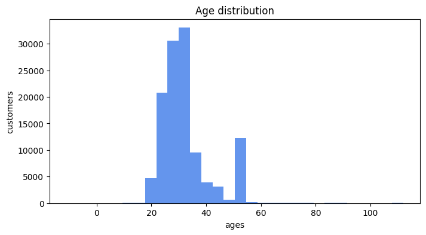
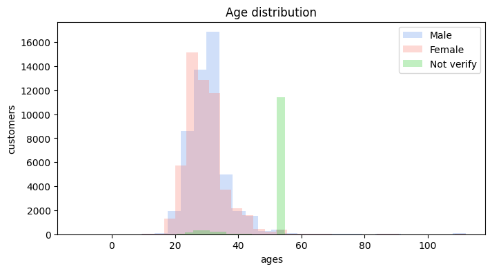
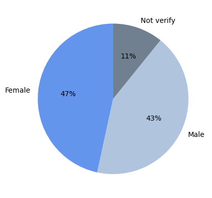
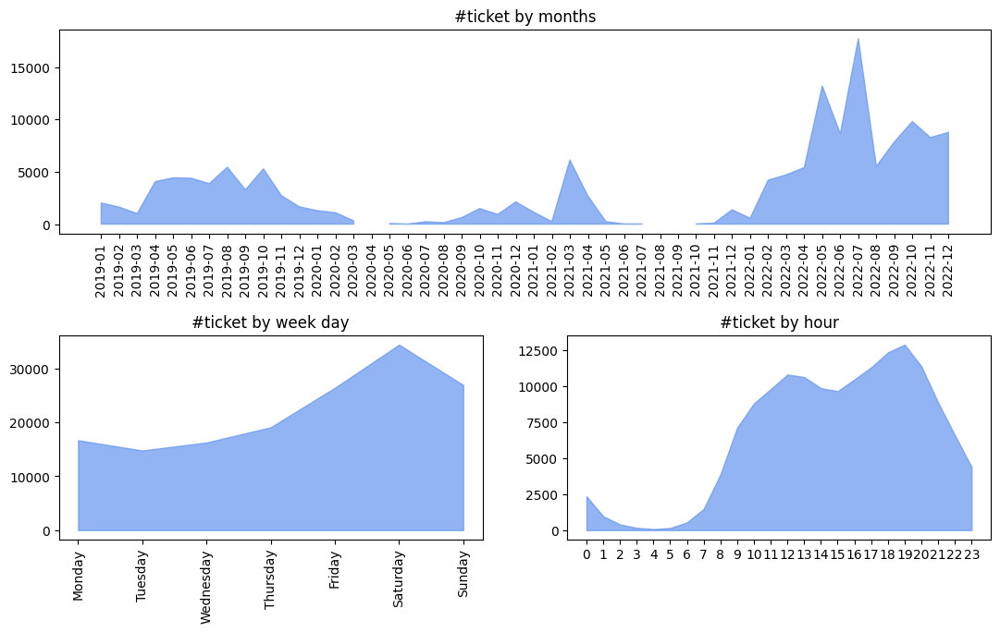
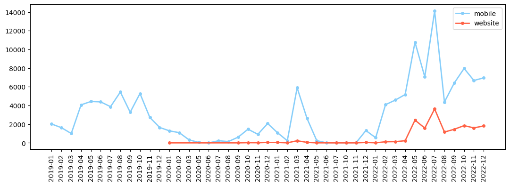
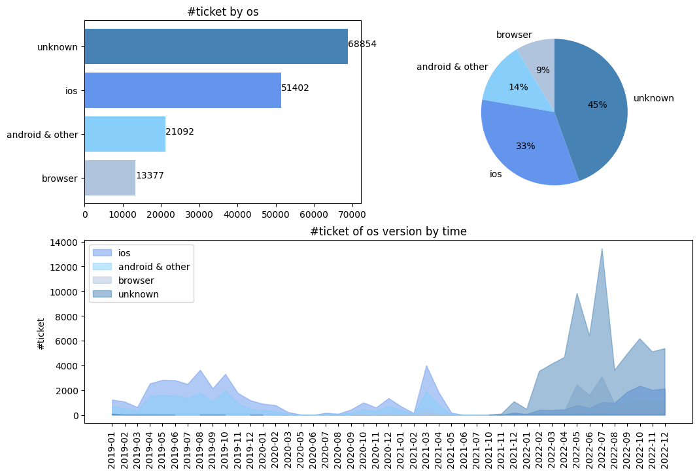
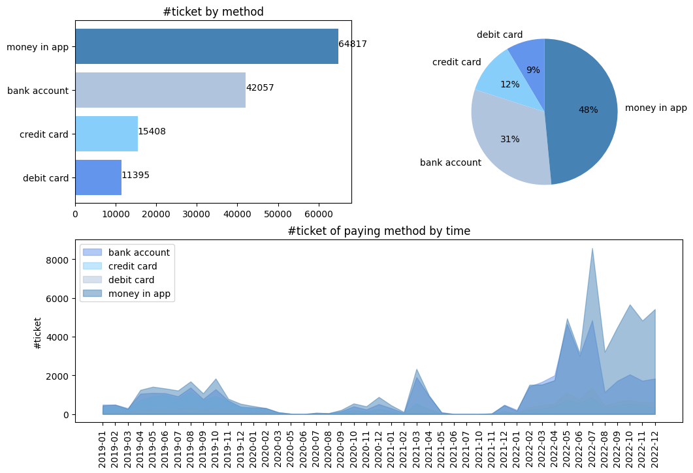
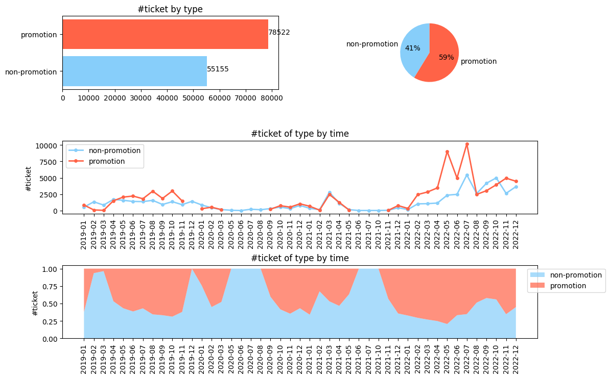
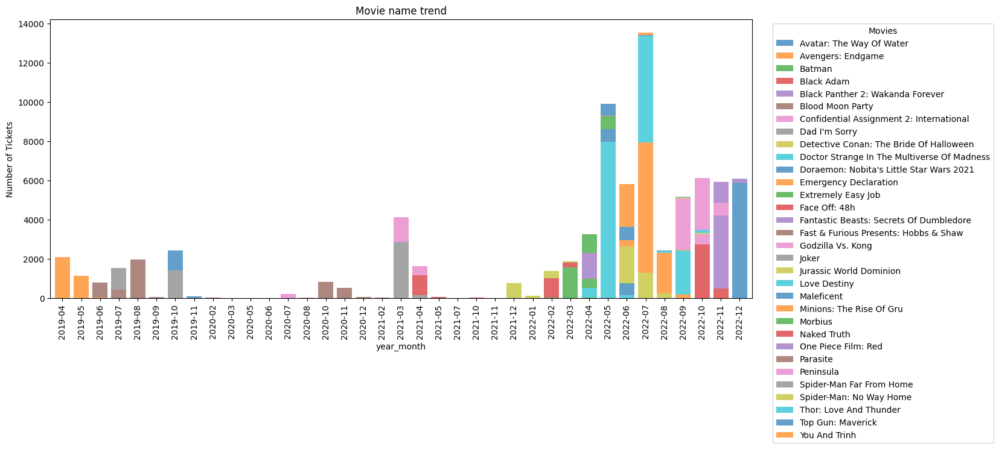

# Customer portrait
## Age distribution

# Age distribution by gender

# Time series data - When did customers buy ticket

# Factors related to the customer's purchasing process
## Platform

## OS version

## Paying method

## Promotion

## Movie name

